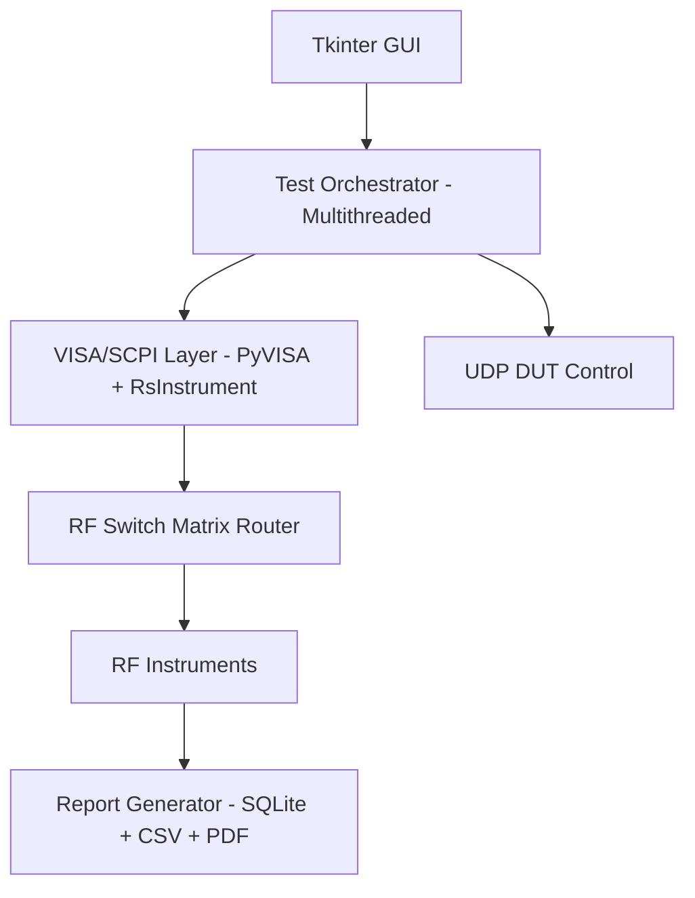

# RF Automated Test Equipment (ATE) System
**Organisation:** DRDO – LRDE, Bangalore | May 2025 – July 2025  
**Role:** ATE System Intern  
> Code is proprietary to DRDO-LRDE. This README documents the system architecture 
> and my contribution for professional reference.

---

## Overview

Manual RF testing at the lab involved an engineer sitting through hours of 
instrument setup, measurement recording, and report writing — repeated for 
every device under test, across three separate test routines. This system 
eliminated all of that.

I designed and deployed a production Python ATE system that fully automated 
Harmonics analysis, TX Power measurement, and Spurious Emission testing on 
RF devices — from instrument control to final PDF report, with zero manual 
intervention.

--- 

## System Architecture

## What It Does

| Test Routine | What It Measures | Automation Achieved |
|---|---|---|
| Harmonics | Harmonic distortion of RF output | Full — instrument setup to pass/fail |
| TX Power | Transmitted power across frequency | Full — sweep, log, report |
| Spurious Emission | Unintended out-of-band signals | Full — flagging + documentation |

**Before:** Engineer manually configures instruments, records measurements, 
writes report. Hours per device.  
**After:** Select test → press run → collect PDF. Zero intervention.

---

## Tech Stack

| Layer | Technology |
|---|---|
| GUI | Python, Tkinter |
| Instrument Control | PyVISA, RsInstrument, SCPI protocol |
| DUT Communication | UDP sockets |
| Concurrency | Python threading (3 parallel routines) |
| Data & Logging | SQLite |
| Report Generation | ReportLab (PDF), CSV |

---

## Key Engineering Decisions

**Why multithreading?** The three test routines (Harmonics, TX Power, Spurious) 
operate on independent signal paths via the RF switch matrix. Running them 
sequentially left expensive instrument time idle. Threading them cut total 
test time significantly without introducing measurement interference.

**Why SCPI over a higher-level driver?** Direct SCPI gave us deterministic 
timing control critical for RF measurements where instrument state 
synchronisation matters. RsInstrument was used as a thin wrapper where 
Rohde & Schwarz-specific commands simplified setup.

**Why SQLite for logging?** Lightweight, no server overhead, and test metadata 
(timestamps, pass/fail flags, measurement values) needed to persist locally 
for audit trails without external dependencies.

---

## Outcome

- Eliminated manual test execution across all 3 RF test routines
- Automated structured PDF and CSV report generation for every test cycle  
- Deployed and used in active lab environment at DRDO-LRDE

---

## Contact

**Rishita Nigam** · rishitanigam14@gmail.com · [LinkedIn](https://linkedin.com/in/rishitanigam)
